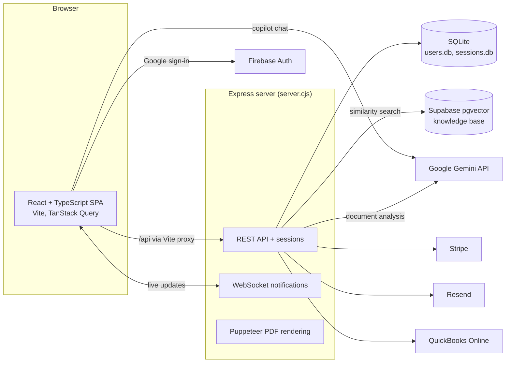

# Blueprint

Construction project management and financial planning (FP&A) for contractors, with an AI copilot that understands your projects and quotes.

Blueprint helps construction teams keep project finances under control. You create projects, build quotes from line items tagged with industry-standard cost codes, record change orders and actual costs, and compare budget against actuals as work progresses. An AI layer reads uploaded quote documents and turns them into structured line items, and a chat copilot answers questions using your project data plus a small construction-finance knowledge base (retrieval-augmented generation). It is a full-stack TypeScript/Node app with Google sign-in, team roles, Stripe subscriptions and a QuickBooks integration.

## Features

**Projects and financials**
- Projects with status, priority, budget, and per-project team access
- Quotes with line items, vendors and CSI MasterFormat cost codes (importable templates)
- Change orders linked to quotes, with cost impact
- Actual cost ledger, baseline budget freeze, and a Budget vs Actuals report with health indicators
- Vendor directory
- Branded quote PDF export (HTML template rendered with Puppeteer, company logo upload)

**AI**
- Document analysis: upload a PDF or text quote and Google Gemini extracts the quote and line items
- AI insights on project and quote data
- AI Copilot chat that retrieves relevant knowledge-base passages (Transformers.js embeddings + Supabase pgvector) and can create projects and quotes through Gemini function calling

**Platform**
- Google sign-in (Firebase Auth) with server-side Express sessions
- Team invitations by email (Resend) with Admin / Member roles
- Real-time notifications over WebSockets
- Global search / command palette, dark and light themes
- Stripe Checkout and Customer Portal for subscriptions, with webhook handling
- QuickBooks Online OAuth 2.0 connection and import of purchase transactions as actual costs

## Architecture



- **Frontend** (`src/`): React 18 + TypeScript, built with Vite. Server state is managed with TanStack Query; mutations and shared UI state live in React context providers. In development Vite proxies `/api` to the Express server on port 4000.
- **Backend** (`server.cjs`): a single Express 5 server that owns the business data in SQLite (schema is created and migrated on startup), handles sessions, file uploads (Multer), PDF parsing and generation, Stripe, Resend and QuickBooks calls, and pushes notifications over a WebSocket server on the same port.
- **Knowledge base** (`knowledge-base/`, `scripts/`): Markdown articles are embedded with `all-MiniLM-L6-v2` via Transformers.js and stored in a Supabase `knowledge` table; the server queries them through a `search_knowledge` SQL function.

Further design notes are in [docs/ARCHITECTURE.md](docs/ARCHITECTURE.md), [docs/RAG_SETUP.md](docs/RAG_SETUP.md) and [docs/TESTING.md](docs/TESTING.md).

## Tech stack

| Area | Technology |
|------|------------|
| Frontend | React 18, TypeScript, Vite, Tailwind CSS, Radix UI, Framer Motion, TanStack Query, React Router, Recharts, cmdk |
| Backend | Node.js, Express 5, SQLite (`sqlite3`, `connect-sqlite3`), `ws`, Multer, pdf-parse, Puppeteer |
| AI | Google Gemini API, Transformers.js, Supabase pgvector |
| Auth | Firebase Authentication (Google), express-session |
| Integrations | Stripe, Resend, QuickBooks Online |
| Testing / tooling | Cypress, ESLint, nodemon, concurrently |

## Getting started

### Prerequisites

- Node.js 18+ and npm
- A Firebase project with Google sign-in enabled
- A Google Gemini API key (for AI features)
- Optional: a Supabase project (knowledge base), Stripe account, Resend account, QuickBooks developer app

### Environment variables

Copy `.env.example` to `.env` and fill in the values you need.

| Name | Used by | Purpose |
|------|---------|---------|
| `VITE_API_BASE_URL` | Frontend | Express API base URL (default `http://localhost:4000`) |
| `VITE_FIREBASE_API_KEY`, `VITE_FIREBASE_AUTH_DOMAIN`, `VITE_FIREBASE_PROJECT_ID`, `VITE_FIREBASE_STORAGE_BUCKET`, `VITE_FIREBASE_MESSAGING_SENDER_ID`, `VITE_FIREBASE_APP_ID`, `VITE_FIREBASE_MEASUREMENT_ID` | Frontend | Firebase web app config for Google sign-in |
| `VITE_GEMINI_API_KEY` | Frontend and server | Google Gemini API key |
| `SESSION_SECRET` | Server | Signs session cookies |
| `FRONTEND_URL` | Server | Frontend origin for Stripe redirects and invitation links |
| `ENCRYPTION_KEY` | Server | Encrypts stored QuickBooks tokens |
| `SUPABASE_URL`, `SUPABASE_ANON_KEY` | Server, scripts | Supabase project for the knowledge base |
| `STRIPE_SECRET_KEY`, `STRIPE_WEBHOOK_SECRET` | Server | Subscriptions and webhook verification |
| `RESEND_API_KEY` | Server | Team invitation emails |
| `QUICKBOOKS_CLIENT_ID`, `QUICKBOOKS_CLIENT_SECRET`, `QUICKBOOKS_REDIRECT_URI` | Server | QuickBooks OAuth |
| `INVITE_TEST_EMAIL` | Server | Optional address exempt from invitation duplicate/rate limits during testing |

Gemini, Stripe, Supabase and QuickBooks features are disabled with a startup warning when their variables are missing.

### Install and run

```bash
npm install

# Frontend (http://localhost:5173) and API (http://localhost:4000) together
npm start

# Or separately
npm run dev       # Vite dev server
npm run server    # Express API with nodemon
```

The SQLite databases (`users.db`, `sessions.db`) are created automatically on first run and are git-ignored.

### Knowledge base (optional)

Create the `knowledge` table and `search_knowledge` function in Supabase (SQL in [docs/RAG_SETUP.md](docs/RAG_SETUP.md); `npm run setup-supabase` prints it if it cannot create it), then embed the articles:

```bash
npm run embed
```

### Build and test

```bash
npm run build       # production frontend build to dist/
npm run lint        # ESLint
npm run test:e2e    # Cypress end-to-end tests (requires the app running)
```

## Project structure

```
.
├── src/
│   ├── components/        # Pages and UI (projects, quotes, reports, AI copilot, settings)
│   │   ├── layout/        # Header, search, create menu
│   │   ├── settings/      # Company profile, team, billing, cost codes, integrations
│   │   └── shared/
│   ├── contexts/          # React context providers for app state and mutations
│   ├── utils/             # TanStack Query hooks, Firebase/Google auth, helpers
│   ├── App.tsx            # Routes
│   └── main.tsx           # Entry point
├── server.cjs             # Express API, SQLite schema, WebSockets, integrations
├── quote-template.html    # HTML template for quote PDFs
├── knowledge-base/        # Markdown articles for the AI copilot
├── scripts/               # Embedding and Supabase setup scripts, cost-code templates
├── cypress/               # End-to-end tests
├── docs/                  # Architecture, RAG setup, testing and UI notes; sample quote files
├── public/                # Static assets
├── uploads/               # Runtime uploads (avatars, logos); contents git-ignored
└── vite-plugin-backend-watch.ts  # Dev plugin: reloads the browser when the API restarts
```

## Status

Portfolio project in active development; not deployed publicly. The main workflows run locally end to end. Known limitations:

- The backend is a single large `server.cjs` file with SQLite; splitting it into route modules and moving to Postgres would be the next refactor.
- The server trusts the Google user profile sent by the client after Firebase sign-in; it should verify the Firebase ID token with the Firebase Admin SDK before creating a session.
- Development-only endpoints (`/api/test-session`, `/api/test/login`) must be disabled outside development.
- The AI Copilot calls Gemini directly from the browser, which exposes the API key in the bundle; those calls should move behind the API.
- `npx tsc -p tsconfig.app.json` reports a handful of existing type errors and `npm run lint` currently crashes on an ESLint plugin version mismatch; the Vite build is unaffected.

## License

Released under the [MIT License](LICENSE).
